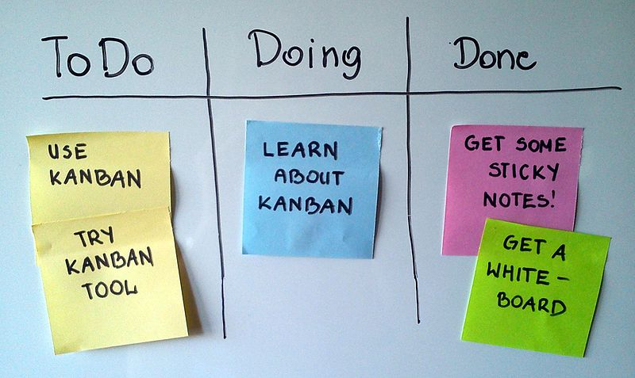
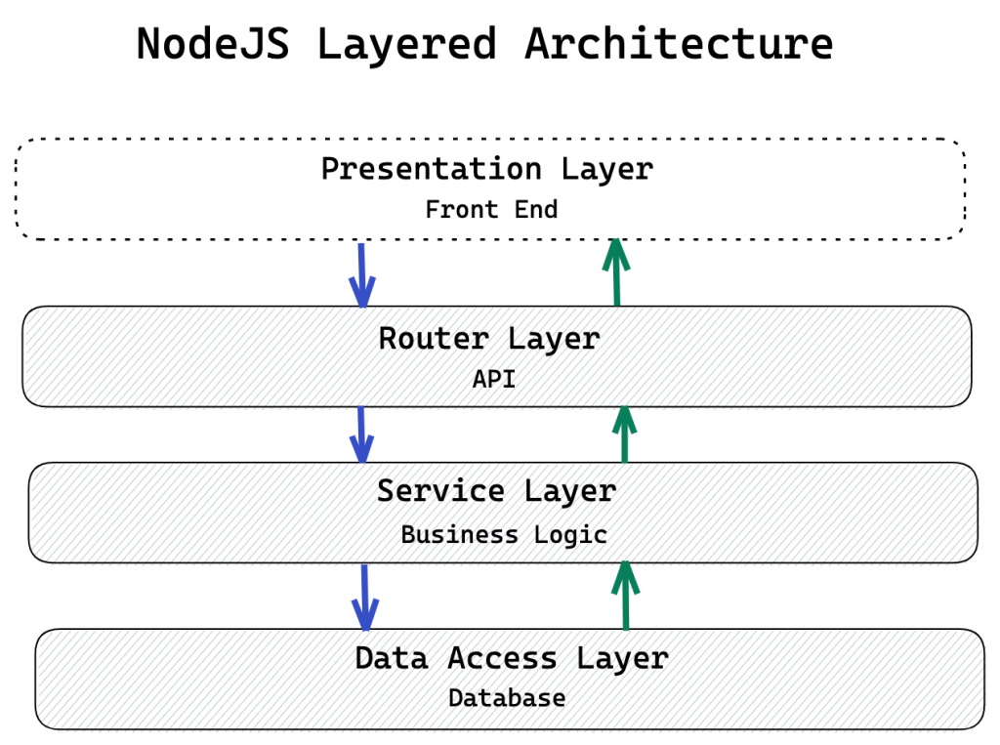

<!-- _class: lead -->
# Sort Visualizer 📊

`By: Juan Vergara & Jorge Loayza`
    

---

## `Methodology:` **Agile with Kanban method**

Priciples:

* VISUALIZE
* LIMIT (WIP)
* OPTIMIZE
* IMPROVE

**Tool:** GitLab

---

<!-- _class: lead-->

# `Estimation`

`Five days` starting on November 23 and ending on Novermber 29
Working `8hr per day` and `4hr per person` with a total of 40 hr.

---

<!-- _class: lead -->
# `Technological Stack and Tools`

- Frontend: **Angular**
- Backend: **NodeJS y Express**
- Monorepo in **GitLab**

___

<!-- _class: lead -->
# `Architecture`

### Frontend: **Separation of concerns & LIFT principles**
### Backend: **Layered Architecture**

___

---

# `Architecture:` Three-tier

---

# `References`

- Filipova, O., & Vilão, R. (2018). Software Development From A to Z. Primera Edic. Berlín: Apress.
- Layton, M. C., Ostermiller, S. J., & Kynaston, D. J. (2020). Agile project management for dummies. John Wiley & Sons.
- https://codingsans.com/blog/kanban-in-software-development
- https://www.atlassian.com/agile/kanban
- http://bguiz.github.io/js-standards/angularjs/application-structure-lift-principle/
